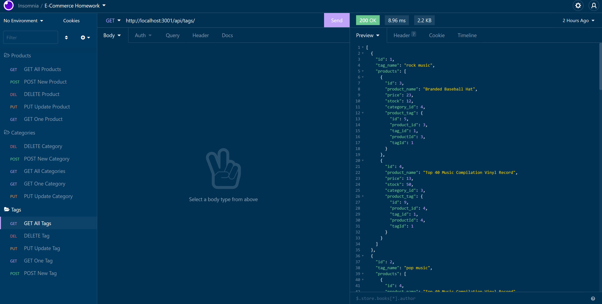
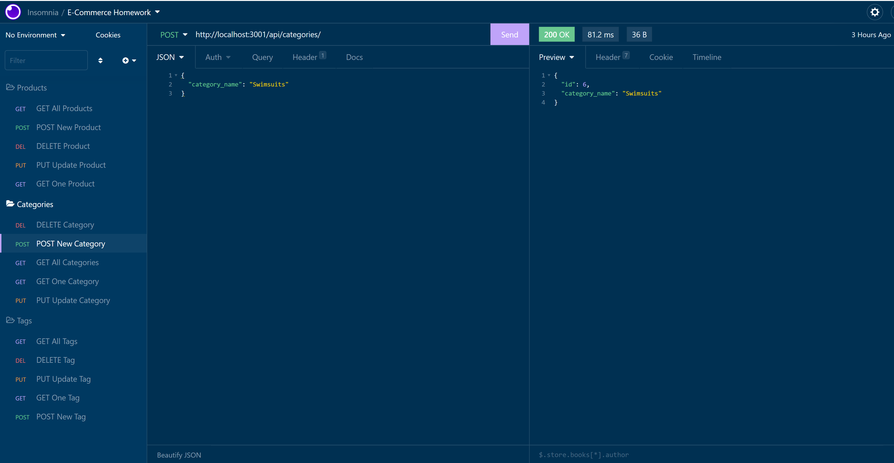

# E-Commerce-Back-End
 

This is a back-end portion of an E-commerce application. Express.js, MySQL, and the ORM, Sequelize, are used to query a seeded database. I use RESTful API routes to make GET, POST, PUT, and DELETE requests from the E-commerce database via Sequelized queries. These requests are tested using Insomnia.

## Installation

1. Clone repository and use Node.js to run the application
2. Use `npm install` in the root directory to install the required npm packages
3. Use `npm start` to start the server.

## Usage

* To start using the application in VS Code, right-click the file, schema.sql, and click run in integrated terminal. After you've logged in to mysql use the following commands in the terminal:

source schema.sql

...to create the database.

It is also necessary to run `npm run seed` in order to acquire the starter data.

The application is invoked by running `node server.js` in the command line via the server.js terminal.

* [Video Demo]

* Screenshot:

* Website
  * [Github](https://github.com/Mully7773/E-Commerce-Back-End)

## Features

* JavaScript
* Node.js
* MySQL
* Sequelize
* Express.js
* Insomnia
* npm packages
  * dotenv
  * mysql2
 

## Author

Nick Mullenmeister
